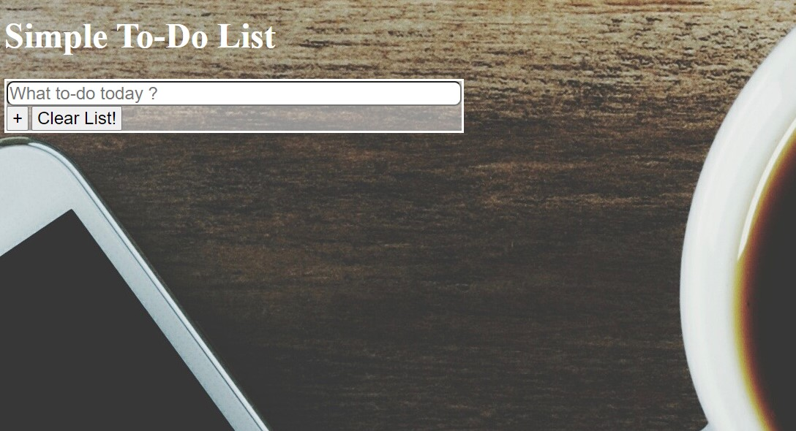

### Hi there 👋, my name is Pedro Leonardo
#### Welcome to my simple to-do list

This is a simple todo list that allows you to keep track of the things you need to do through the day. You are able to add and also clear the list when your done.

## How It's Made:

**Tech used:** HTML, CSS, JavaScript, Framework of choice

By using JS I was able to return the value in the input field and display it in a list so that it adds to task. Once your done your able to clear the task you've completed.

## Lessons Learned:

Grab the value that is in the input field and being able to display so that it adds to the list created. 
